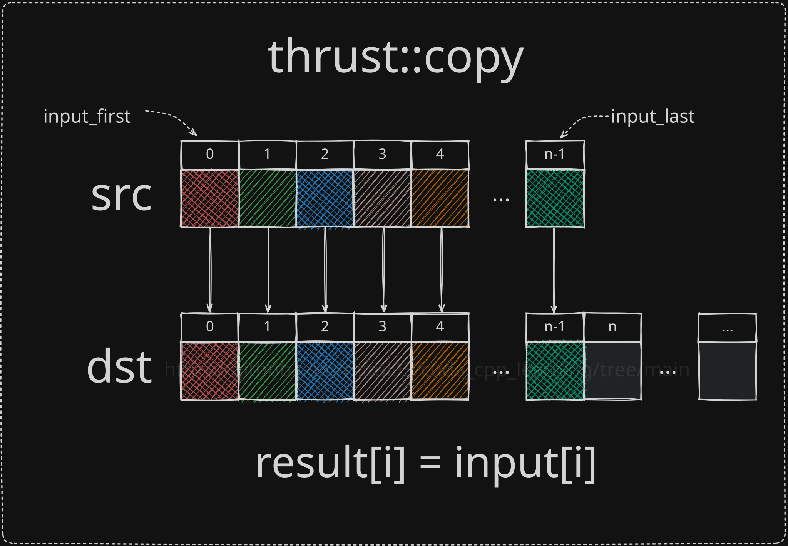
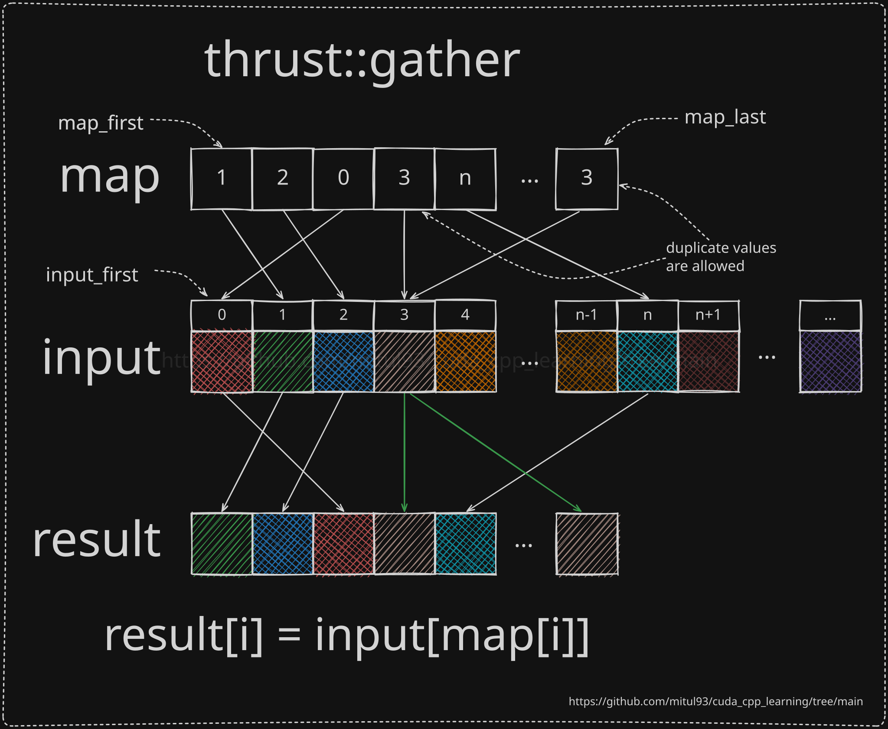
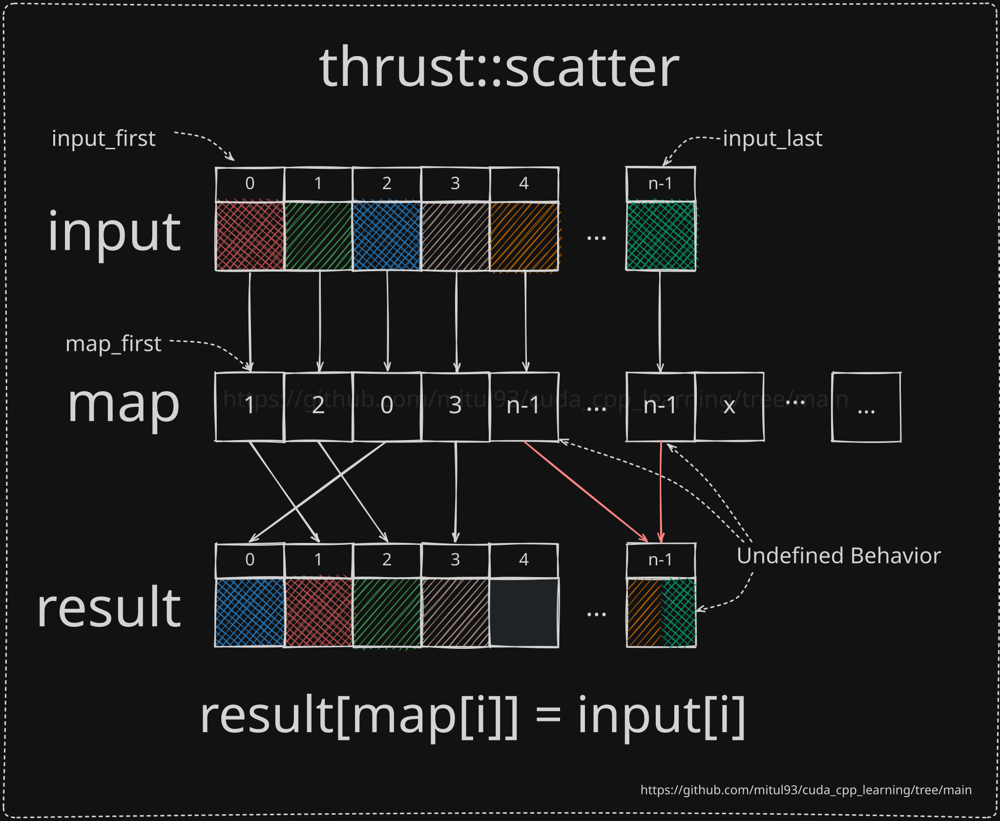
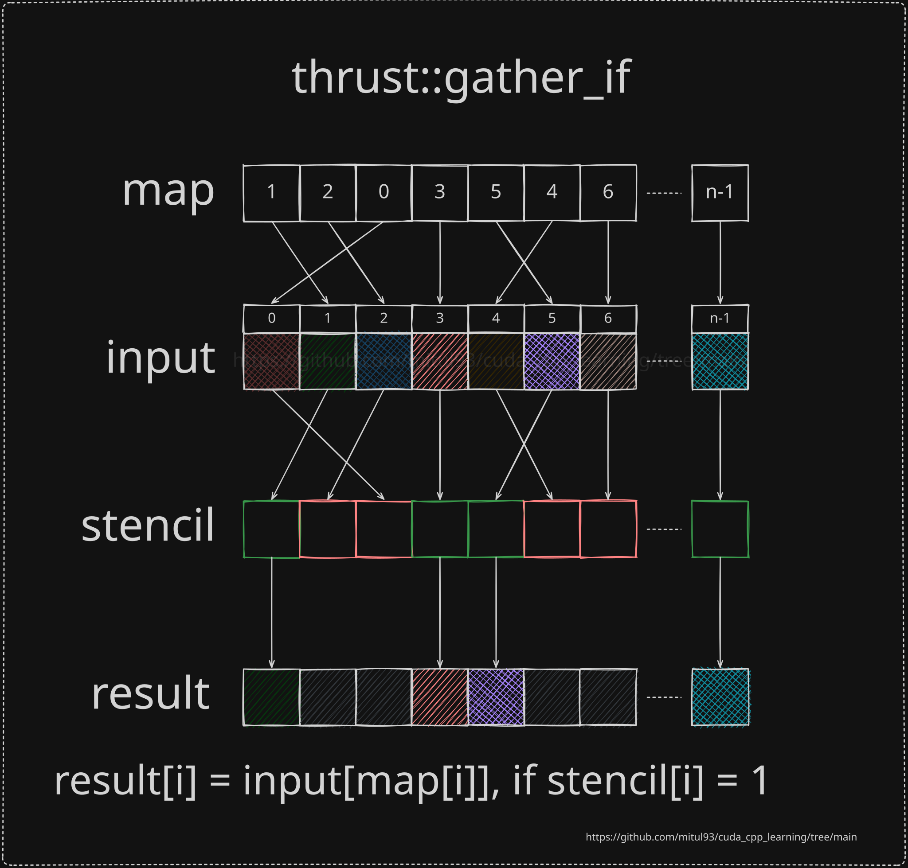

# Thrust Copy, Gather, and Scatter

This directory contains visual illustrations of several commonly used Thrust data movement algorithms.

## `thrust::copy`

Copies a range of elements from an input range to an output range while preserving their order.

---

## `thrust::gather`

Reads elements from arbitrary positions in the input range according to a map and stores them contiguously in the output range.

---

## `thrust::scatter`

Writes elements from the input range into arbitrary positions in the output range according to a map.

---

## `thrust::gather_if`

Performs a conditional gather. Elements are gathered only for indices whose corresponding stencil values satisfy the predicate.

---
